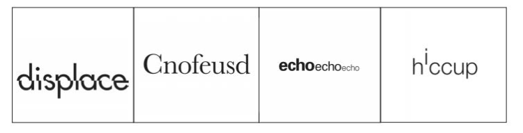

# Illustrated Words Project

## Description

The **Illustrated Words Project** aims to visually capture the expressive meaning of words by transforming their letterforms into imaginative characters. The choice of type-style contributes to the message, but the essence is conveyed through the size and arrangement of the letterforms on the page. Adobe Illustrator is utilized to create a canvas, and various techniques are explored to incorporate type digitally.

## Supplies Needed

- Paper
- Pencil or Pen
- Adobe Illustrator CC
- Printer

## Process

1. **Brainstorming Words**: Compile a list of words (preferably adjectives and verbs) that can be represented visually. Avoid common words and seek unique interpretations. Collaboration and referencing resources like a thesaurus or dictionary can enhance creativity.

2. **Sketching Compositions**: Choose five words from the brainstormed list. Create at least 5 thumbnail sketches for each word. Experiment with letter positioning, spacing, size, and style to convey word meaning. Select 3 compositions that resonate most.

3. **Selecting Typefaces**: Research the list of available typeface families for the project and select an appropriate font for each of your three compositions:

   - [Century Gothic](https://fonts.adobe.com/fonts/century-gothic)
   - [Baskerville](https://fonts.adobe.com/fonts/baskerville-pt)
   - [Quicksand](https://fonts.adobe.com/fonts/quicksand)
   - [Futura](https://fonts.adobe.com/fonts/futura-pt)
   - [Garamond](https://fonts.adobe.com/fonts/garamond-premier)
   - [Mrs Eaves](https://fonts.adobe.com/fonts/mrs-eaves)
   - [Copperplate](https://fonts.adobe.com/fonts/copperplate)
   - [Proxima Nova](https://fonts.adobe.com/fonts/proxima-nova)

   Font selection should complement the essence of the word.

4. **Digital Recreation**: Using Adobe Illustrator, recreate the three chosen compositions. Each layout should measure 6x6 inches.

5. **Feedback and Revision**: Share your work in progress on the Project 1 Discussion Board. Engage with peers by providing feedback on their work. Based on received feedback, refine and revise your compositions for improvement.

6. **Finalization and Submission**: Save the final Illustrator file containing all three compositions as a PDF. Submit the PDF for grading.

## Limitations

- Typeface Choices: Select from the provided typeface families mentioned above.
- Letter Usage: Use all letters from the chosen word. The order of the letters can be rearranged while maintaining word recognizability.
- Case: Letters can be upper or lowercase as desired.
- Imagery: Limit the design to typography only; no additional imagery is allowed.
- Color: Letters should be black, and the background should be white.

## Note

The project emphasizes the application of basic Illustrator skills but is not an Illustrator class. If your creative ideas exceed your current skill level, consider seeking supplementary tutorials. The project encourages working within your skillset while fostering creative imagination.
