# Typography and Layout

## Table of Contents
- [A Brief History of Type](#a-brief-history-of-type)
- [Anatomy of Type](#anatomy-of-type)
  - [Counters and Counterforms](#counters-and-counterforms)
  - [Ascenders and Descenders](#ascenders-and-descenders)
  - [Strokes and Shapes](#strokes-and-shapes)
  - [Junctions of Strokes](#junctions-of-strokes)
  - [Special Strokes of the Letter G](#special-strokes-of-the-letter-g)
  - [Terminals and Serifs](#terminals-and-serifs)
  - [Contrast between Thick and Thin Strokes](#contrast-between-thick-and-thin-strokes)
  - [Angle of Stress](#angle-of-stress)
  - [x-Height Ratio and Set Width](#x-height-ratio-and-set-width)
  - [Type Measurements](#type-measurements)
- [Chapter Summary](#chapter-summary)
## A Brief History of Type

The mass production of written words dates back millennia, utilizing dyes, punches, seals, and even currency to standardize communication and commerce.

The first movable form of type was created in China during the 11th century, using ceramic materials.

Not long after, metal type began to be used in Korea.

However, in languages with thousands of characters, such as those in the Eastern languages, the printing process became a labor-intensive endeavor.

In the Western world, with a more manageable character set, **Johannes Gutenberg** created the first mass-produced book, **The Gutenberg Bible**. Movable type paved the way for the Renaissance and later the Reformation.

Most graphic artists are acquainted with the history of lettering, recognizing the evolution from the hand of master scribes to the craft and art form it is today. Gutenberg played a significant role in transforming the handwritten form into what we now refer to as typographic design.

The challenging-to-read blackletter forms in Gutenberg's work eventually gave rise to the need for more utilitarian, easy-to-read typeface designs. By the 1470s, artists like the Frenchman **Nicholas Jensen**, operating in Venice, Italy, began creating highly legible typographic forms. He was the first to design a Roman face based on humanistic characteristics. His work's beauty is still regarded today as one of the greatest typographic masterpieces.

Numerous others followed suit. Household names in the typography world include John Baskerville, Giambattista Bodoni, William Caslon, Claude Garamond, and later Ed Benguiat, Eric Gill, Herb Lubalin, Hermann Zapf, and many more.

In the late 19th century, German immigrant **Otmar Mergenthaler** developed a machine that cast a hot lead alloy into lines of type. These metal slugs, called Linotype, could be melted down and reused once they were used. The Linotype went on to dominate the typesetting industry throughout the 20th century.

In 1895, Talbert Lanceton created an automated mechanical composing process known as the Monotype system. Operators used a keyboard to prepare a punched paper tape, which directed hot metal casting to create typeset text.

Most large publishing houses and newspapers used automated typesetting systems like Linotype and Monotype.

**Objectives:**

- Become fluent in the terminology of typography.
- Understand the different kinds of typographic guidelines and their purposes.
- Recognize and name the different kinds of strokes, junctions, and negative spaces that are used to create letterforms.
- Identify the structural aspects of type.
- Identify a variety of differently shaped terminals and serifs.
- Learn how to measure type using points and picas.

**Introduction:**
Letterforms are built of combinations of straight and curved strokes. Sounds simple, right? Not quite so! As you can see from the vast variety of available typefaces, the way strokes are physically rendered can vary widely; the way these strokes look and relate to one another gives a typeface its sense of identity. Recognizing the subtle differences between the shapes of letter parts can help you differentiate one typeface from another. Studying typographic terminology and the measurement system will help you become familiar with these physical differences and will let you communicate effectively about type with printers, production houses, other designers, and clients. An awareness of the structural aspects of type can also provide useful insights for making informed design decisions.

### Structural Elements of Letterforms

Because much of the terminology describing letter parts is based on human anatomy, the terminology of typography isn’t difficult, but there is a lot of it to remember. It is important to first understand how guidelines are used to guide the design and use of letterforms, then it is essential to learn about all the parts that make up letterforms.

**Guidelines**

When you write in a ruled notebook, you probably write the words so they appear to rest along the evenly spaced horizontal lines that are printed onto the notebook paper. When you do this, you are using the lines as baselines. Even if your notebook is un-ruled, your letters probably line up fairly evenly along an imaginary baseline. A baseline is a real or imaginary line that the letters of a word rest upon so that the characters appear to line up evenly.

Remember when you were first learning to draw the letters of the alphabet? Your teacher may have given you special paper with additional guidelines printed on it to help you know how tall to make your capital (also called “uppercase” or “majuscule”) letters and lowercase (also called “minuscule”) letters. In Figure 2-1, you see a similar set of typographic guidelines. The line that the letters rest upon is called the baseline. The line that shows how tall to make capital letters is called the cap height. The center dotted line that shows how tall to make most lowercase letters is called the x-height. For tall lowercase letters like b, d, f, h, k, and l, the x-height marks their waistline (the top of the body of the letter) instead of their full height.

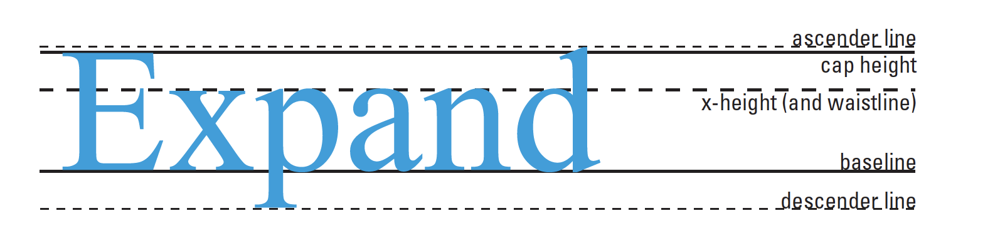

**The x-height is so named because it marks the proper optical height for the lowercase letter x.** The optical size or shape of a letter (the size or shape we perceive) isn’t always the same as the actual size or shape. Because characters are differently shaped, optical illusions sometimes occur that can make evenly sized and spaced characters look uneven. Designers compensate for these optical illusions by making slight adjustments. For example, in some typefaces you’ll notice that the rounded letters like c and e may be ever so slightly taller than the x-height. They were designed that way so that they would appear to be the same height as the other letters, since their rounded shape creates an illusion that they are smaller than their actual size.

**The dotted line that shows how long to make a lowercase g, j, p, q, and y is called the descender line.** Sometimes tall lowercase letters like b, d, f, h, k, and l are the same height as the capital letters, but if they aren’t, an ascender line can mark their proper height (Figure 2-1).

### Counters and Counterforms

The word counter literally means “opposite,” so it makes sense that the white (or negative) spaces inside and around letterforms are called counterforms. The counterforms of letterforms are just as important to letter recognition as the letter shapes themselves. The positive space (the letterforms) and the negative space (the counterforms) exist in relation to each other to produce distinctive characters, as you can see in Figure 2-2.

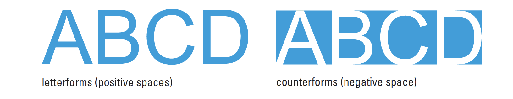

Sometimes characters contain, or even enclose, areas of white space; these areas, like the ones shown in Figure 2-3, are called counters. Counters can be open or closed. As you can see in Figure 2-4, an open counter is a space that is contained, but not enclosed by a character. For example, a crotch, the pointed space where two parts of a character meet, is an open counter. A closed counter is a space that is enclosed by a character. For example, an eye, the small upper space in the lowercase letter e, is a closed counter.

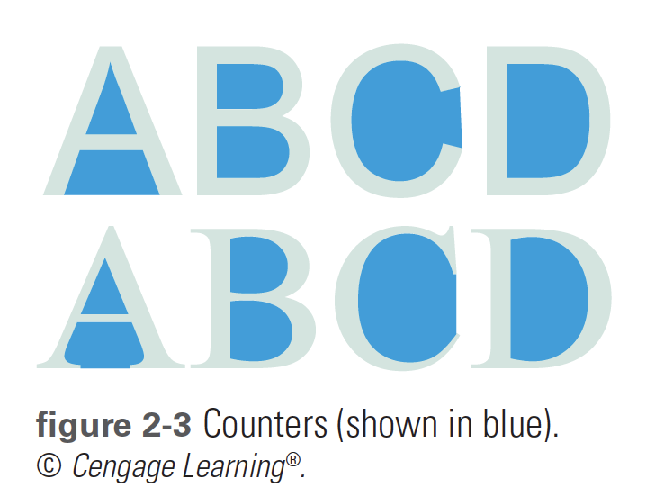
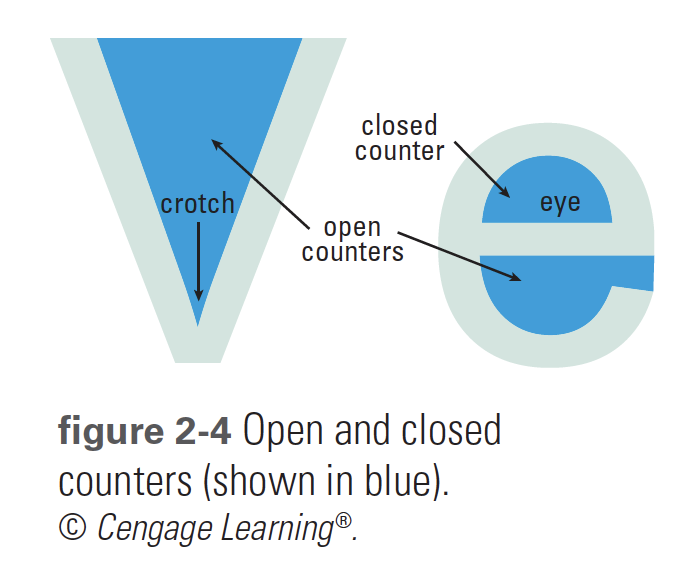

### Ascenders and Descenders

**The section of a tall lowercase character that extends above the x-height is called an ascender**, as shown in Figure 2-5. Most ascenders are as tall as the ascender line, which varies from typeface to typeface. There are exceptions, though. For instance, part of the lowercase letter t ascends above the x-height, but usually it is shorter than the ascender line.

**Some letters like g, j, p, q, y, and Q have parts that descend below the baseline** (Figure 2-5). The section of a character that falls below the baseline is called a descender. Like ascenders, descenders can be long or short, depending on the specific typeface design.

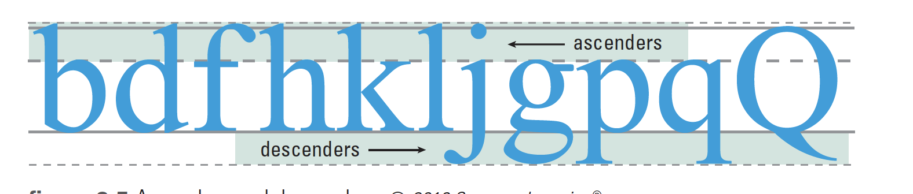

**Strokes**

Each line that is used to build a character is called a stroke. The word “stroke” recalls the calligraphic origins of letters—the stroke of a pen. Strokes can be straight or curved, thick or thin. The straight main stroke of a character is called a stem stroke; these strokes can be vertical or diagonal and are often thicker than the other strokes of the letter. The thinner, secondary strokes of a character are called hairline strokes. You can see examples of stem strokes and hairline strokes in Figure 2-6.

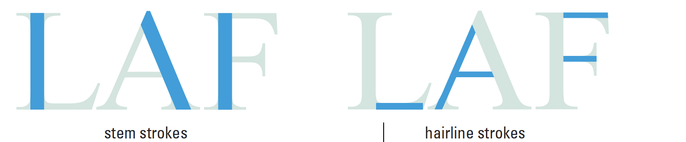

**A hairline stroke that intersects the stem stroke of a letterform, like in the letters T, t, X, and x, is called a cross stroke.** A horizontal hairline stroke that connects two main strokes, as in the letters A, e, and H, is called a crossbar, as shown in Figure 2-7.

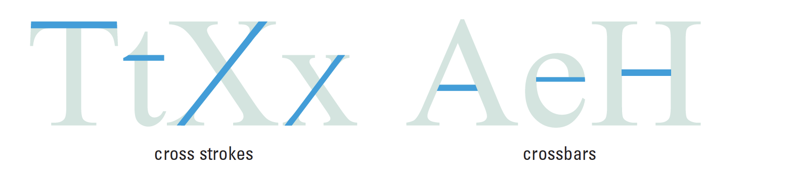

When we talk about stem and hairline strokes, we are referring to whether the stroke is primary or secondary, fat or thin. Other names for strokes describe their shapes and orientations. For example, the main stroke of the letter S has a unique double-curved shape called a spine, as shown in Figure 2-8.

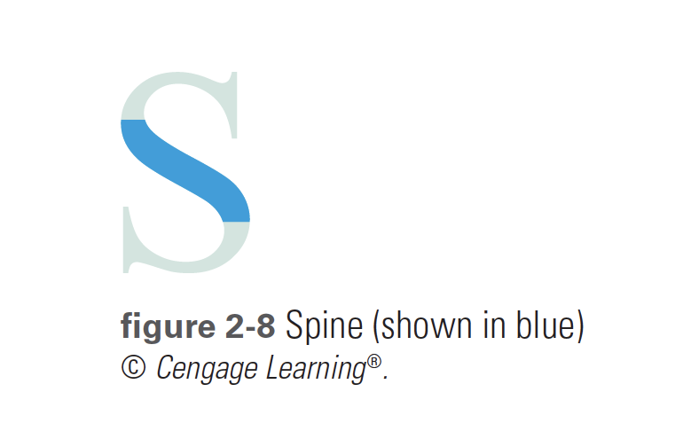

**A secondary stroke, extending from a stem stroke and ending freely, is called an arm.** You can see in Figure 2-9, arms can extend horizontally as in the letter E, or they can extend upward diagonally as in the letter K. The letters E, F, K, k, L, V, v, W, w, Y, y, Z, and z have arms.

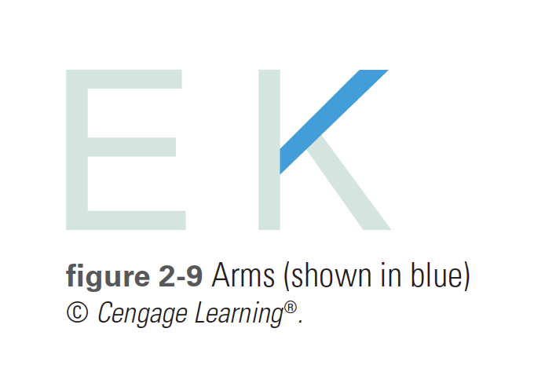

**A secondary stroke that extends downward from a stem to the baseline and ends freely, is called a leg.** You can see in Figure 2-10 that the letters K, k, and R have legs.

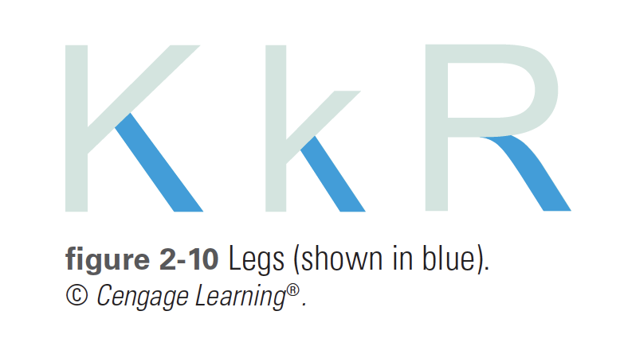

**The diagonal or curved cross stroke at the base of the capital Q that differentiates it from a capital O is called a tail.** The descenders on lowercase j, p, q, and y are sometimes also called tails. See Figure 2-11 for examples of tails.

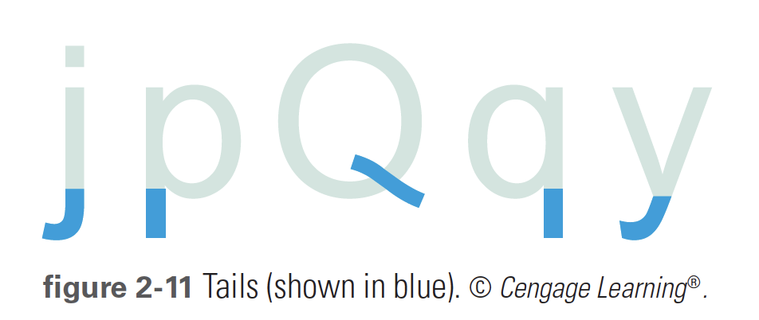

**A curved stroke that encloses a counter is called a bowl.** The letters a, B, b, D, d, g, O, o, P, p, Q, q, and R have bowls. You can see some examples of bowls in Figure 2-12.

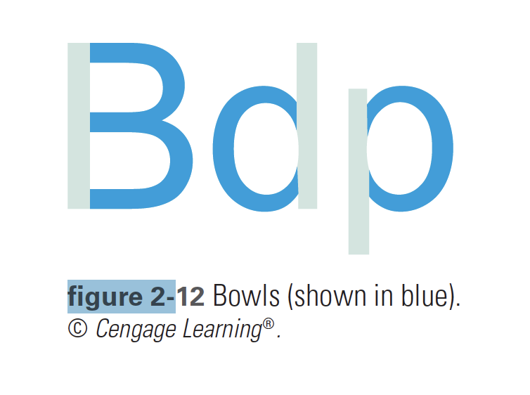

### Junctions of Strokes

**When two strokes angle upward toward each other, as in the letter A, the outermost point where they meet is called the apex.** When two strokes angle downward toward each other, as in the letter V, the outermost point where the two strokes meet is called the vertex. So, for example, the letter W has two vertexes and an apex. Apexes and vertexes can be pointed, flat, rounded, oblique, hallowed, or extended, as shown in Figures 2-13 and 2-14.

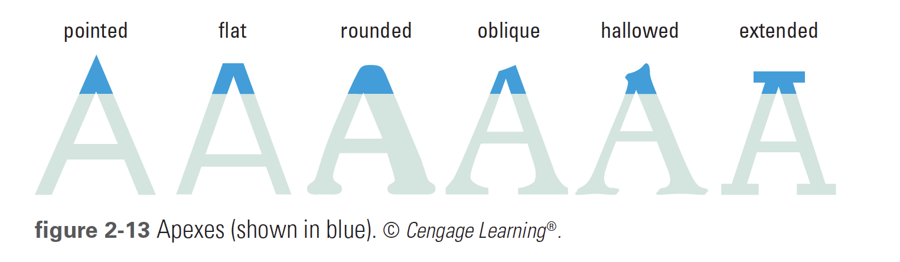

**Some letters have curved strokes that transition into straight ones, as in Figure 2-15; the transitional section of the letter is called the shoulder.** An abrupt transition results in squarish-looking letterforms, while a longer transition gives letterforms a rounder appearance.

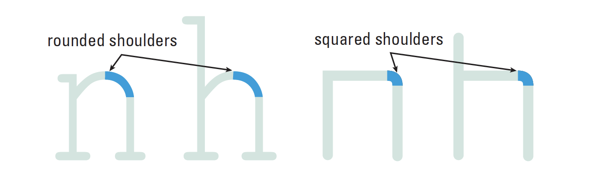

### Special Strokes of the Letter G

**Spurs, loops, links, and ears are all specific to the letter G.** A spur is the small stroke that is sometimes found at the right side of the base of a capital letter G. A loop is the lower curved portion of a lowercase g, and a link is the small connecting stroke that joins the upper and lower parts of a lowercase letter g. An ear is a small stroke that sometimes extends from the top of a lowercase g. Examples of spurs, loops, links, and ears, in a variety of shapes, can be seen in Figure 2-16.

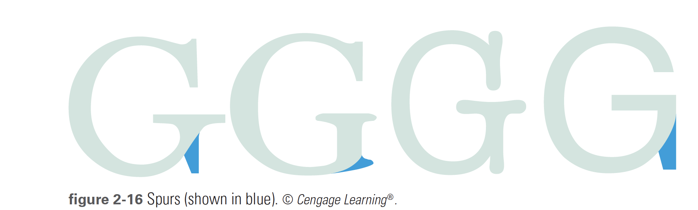

### Shapes of Type

The consistency of stroke shapes is what makes the characters of a typeface seem to “go together.” Throughout history, these aspects have experienced a wide range of interpretations due to technological advancements, social and political shifts, and the influence of popular tastes. Some of the aspects of type that help define the sameness of typefaces are the terminals and serifs of strokes, the contrast between thick and thin strokes, the angle of stress used, the x-height ratio, and the set width.

**Terminals and Serifs**

**A terminal is an endpoint of a stroke.** Strokes can end in a variety of shapes, as shown in Figure 2-20. When letters have extensions at their terminals, we call those extensions serifs. A typeface that has serifs is referred to as a serif typeface, and a typeface without serifs is called a sans-serif typeface. (Sans is the French word for “without” so sans serif literally means “without serifs.”) The origin of using serifs at the terminals of letters is widely thought to be the ancient Roman texts, in which the chisels used to carve letterforms into stone walls and tablets left such extensions at the terminals of letterforms, as can be seen in Figure 1-8. For this reason, upright (non-italic/non-oblique) letters that have serifs are often referred to as roman.

**The shapes of serifs can vary widely, as shown in Figure 2-21.** They can be oblique (angled), rounded, cupped (arched like a foot), splayed (widens gradually like a bell-bottom pant leg), pointed, flat, squared, or scalloped. They can be thin, thick, or even reverse-weight (thicker than the stem’s stroke weight).

### Terminals and Serifs

**A terminal is an endpoint of a stroke.** Strokes can end in a variety of shapes, as shown in Figure 2-20. When letters have extensions at their terminals, we call those extensions serifs. A typeface that has serifs is referred to as a serif typeface, and a typeface without serifs is called a sans-serif typeface. (Sans is the French word for “without” so sans serif literally means “without serifs.”) The origin of using serifs at the terminals of letters is widely thought to be the ancient Roman texts, in which the chisels used to carve letterforms into stone walls and tablets left such extensions at the terminals of letterforms, as can be seen in Figure 1-8. For this reason, upright (non-italic/non-oblique) letters that have serifs are often referred to as roman.

**The shapes of serifs can vary widely, as shown in Figure 2-21.** They can be oblique (angled), rounded, cupped (arched like a foot), splayed (widens gradually like a bell-bottom pant leg), pointed, flat, squared, or scalloped. They can be thin, thick, or even reverse-weight (thicker than the stem’s stroke weight).

Often, serifs are bracketed. A bracketed serif has a curved wedge connecting the serif to the stem stroke, easing the transition between them. Serifs can be bracketed heavily, lightly, or not at all, as you can see in Figure 2-22.

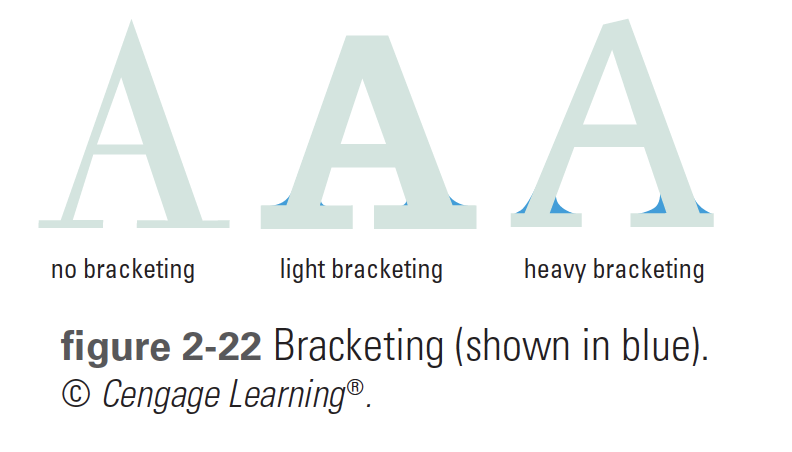

Sometimes horizontal strokes may end in half-serifs, which are called beaks. You can see examples of beaks in Figure 2-23.

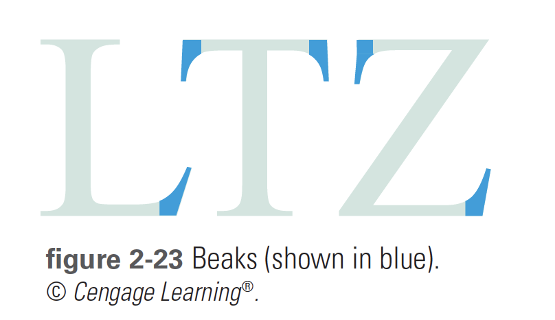

Curved strokes sometimes have serifs that are shorter on one end than on the other, called barbs. See examples of barbs in Figure 2-24.

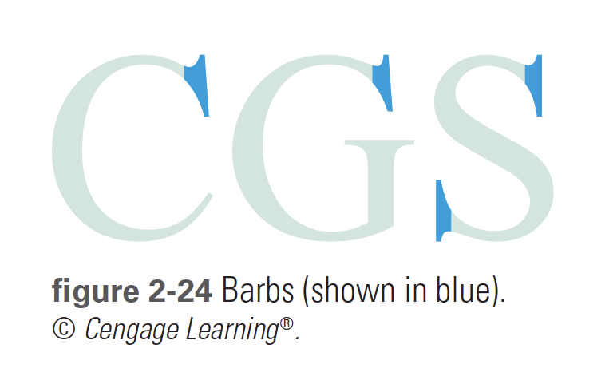

Sometimes the terminals end with a decorative extended stroke called a swash, as shown in Figure 2-25. Most often swashes are found on script typefaces, but not always.

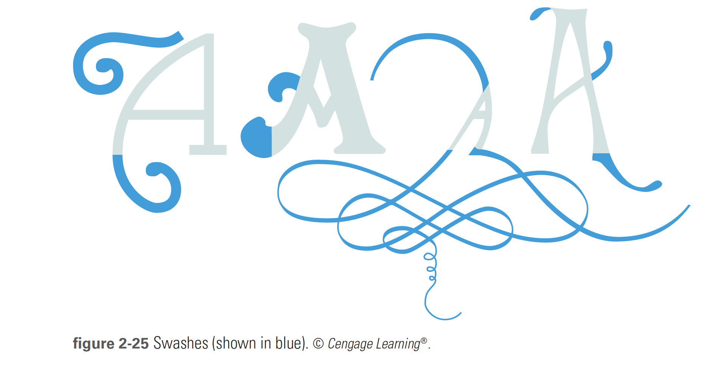)

### Contrast between Thick and Thin Strokes

**Another important aspect of type is contrast—that is, the variation in thickness between a character’s thickest and thinnest stroke weights.** The stroke weight refers to the thickness of the individual strokes of a character. If the stem stroke is much thicker than the hairline strokes of a character, we say the typeface has high contrast, and if there is little variation in the thickness of the strokes, we say it has low contrast. A typeface with no variation in the optical weight of its strokes is said to have no contrast. Examples of letters with high, low, and no contrast are pictured in Figure 2-26.

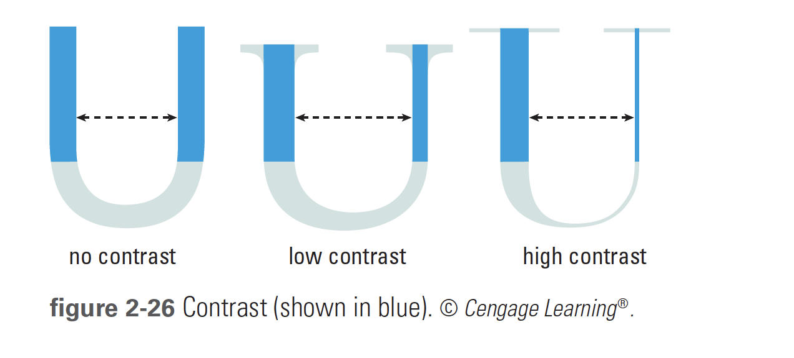

### Angle of Stress

**The concept of angle of stress is based in the calligraphic ancestry of print—a wide-nibbed pen makes a varying mark depending on the angle at which the pen is held.** As you can see from Figure 2-27, strokes that flow in the same direction share a consistent stroke weight. The angle of stress describes the angle to which the main strokes of a typeface aim, in relation to their baseline. You can identify any font’s angle of stress by drawing an imaginary line through the thinnest membranes of a curved letterform like the letter O, as in Figure 2-28.

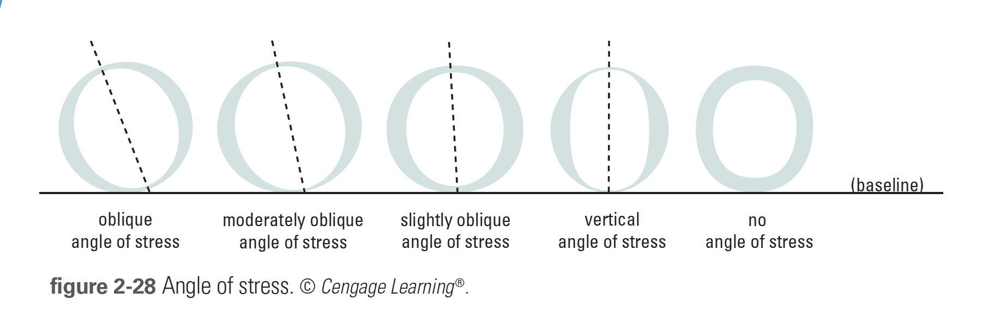

### x-Height Ratio and Set Width

**The proportions of a typeface are defined mainly by the x-height ratio and the set width.** The x-height ratio of a typeface describes the height of regular lowercase letters (those without ascenders) in relation to the typeface’s cap height. The term “x-height” is so named because the letter x provides a good standard for making this measurement. As you can see from Figure 2-29, the x-height ratio can vary from typeface to typeface. Some typefaces have tall x-heights, while others have short ones.

**The set width of a letter describes how wide the character is, relative to its cap height.** If a letter appears short and squat, we say it has a wide set. If it appears thin and lanky, we say it has a narrow set. Figure 2-30 shows letters of varying set widths.

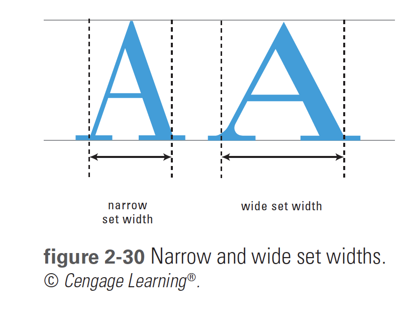

### Type Measurements

**Because we generally use type at such a small scale, tiny units of measure are needed for designing and laying out type.** At present, the most commonly used type measurement system is the PostScript Point Scale, adapted from the American Point Scale, whose units of measure include the inch, the pica, and the point. The inch is, of course, a standard unit of measure in the United States. The pica, usually used for measuring lines of type, is exactly 1⁄6 of an inch, as you can see from Figure 2-31; a pica can be further subdivided into 12 points, the units most often used to measure character sizes and spacing.

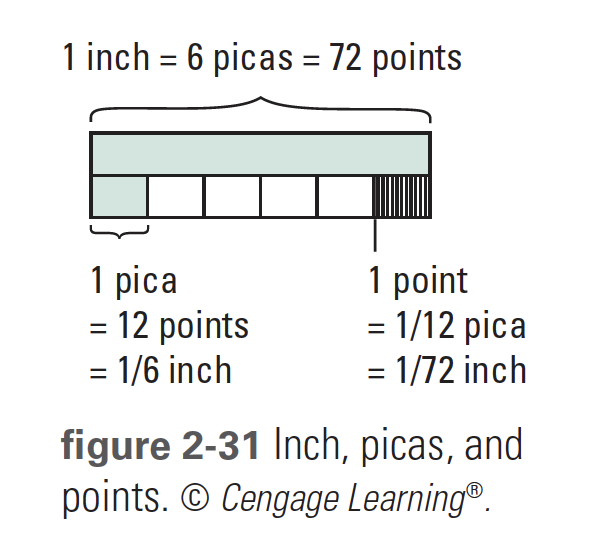

**The typefaces used for letterpress printing are cast onto a rectangular lead sort, as you can see in Figure 2-32. When we talk about the point size of a typeface, we are usually referring to the body size of the type. The body size must include enough space to accommodate any capital and lowercase letter in full, plus extra room to prevent adjacent printed characters from touching each other.** Even though letterpresses are rarely used today, the concept of the type’s body size has been transferred to the virtual environment. In Figure 2-32, you can compare a glyph on a lead sort to its digitized counterpart.

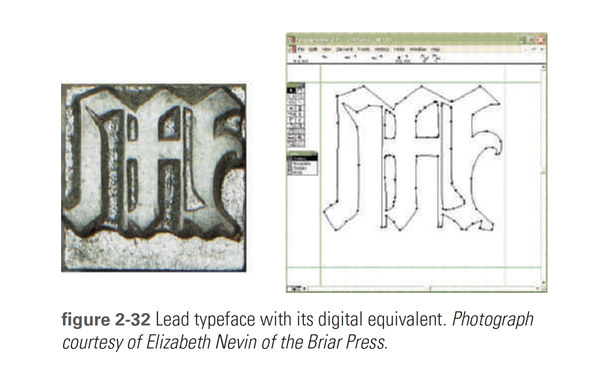

**You can determine the point size of a typeface by using a rule like the one pictured in Figure 2-33 to measure from the baseline of one line of text to the baseline of the next.** For example, notice that in Figure 2-33, the baselines of the text align with the 12-point gauge on the rule.

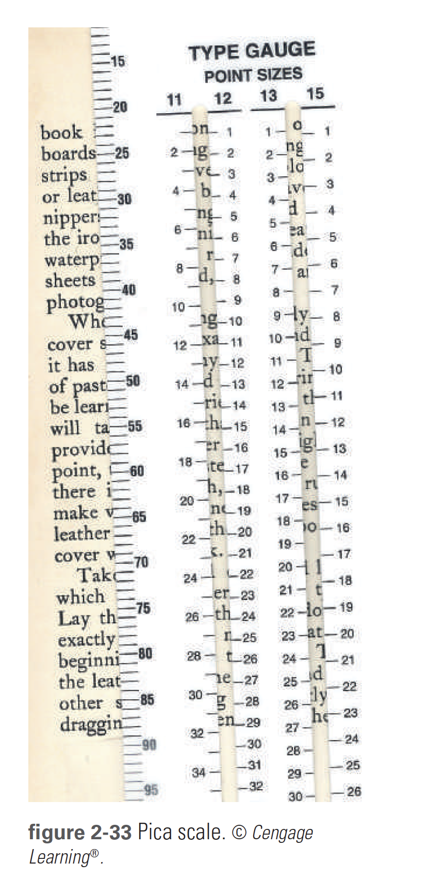

**Sometimes extra space is added between lines of type. In letterpress printing, this was done by placing thin strips of lead between lines of type, as in Figure 2-34.** These strips of lead are called leading (pronounced leding). Again, the concept of leading has been transferred to the virtual environment. Even though we no longer use lead to separate lines of text, we still refer to line spacing as leading.

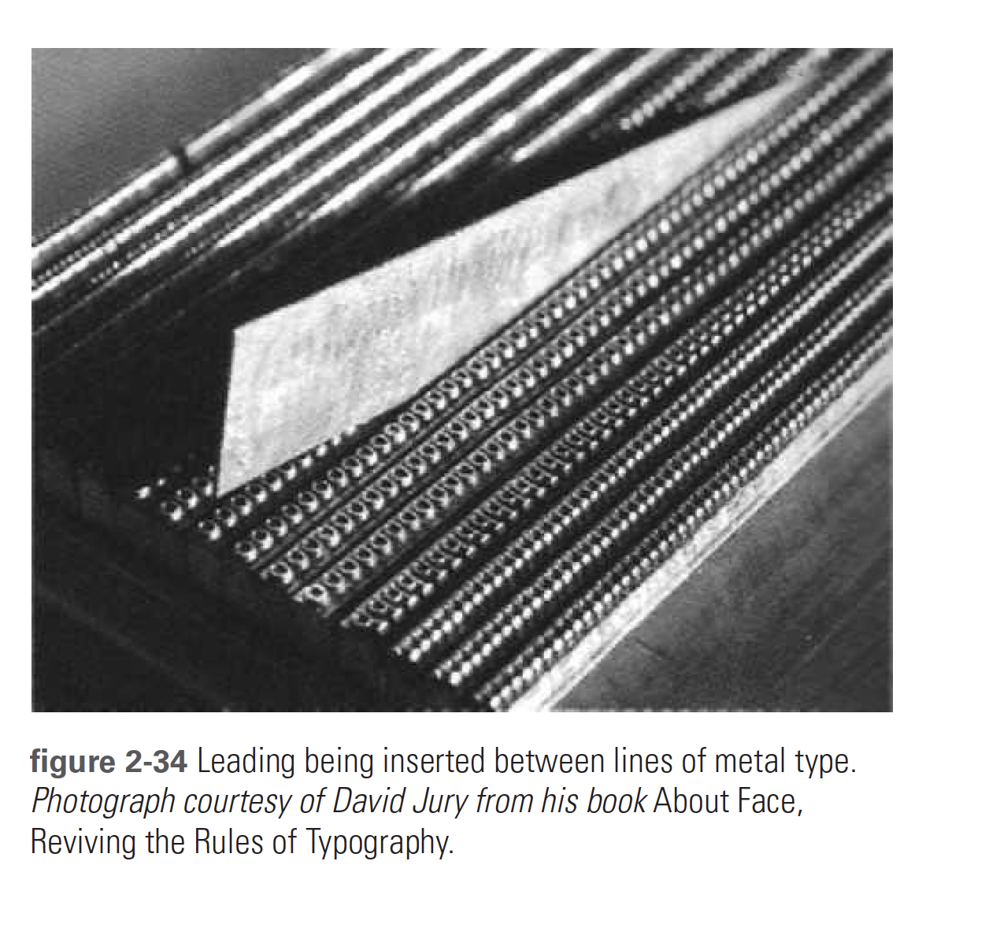

**When leading is added to the body size of a typeface, both measurements are added together to determine the type’s point size, as shown in Figure 2-35.** So, for instance, 35-point type with 13 points of leading would be expressed as 48 points, or 35/48.

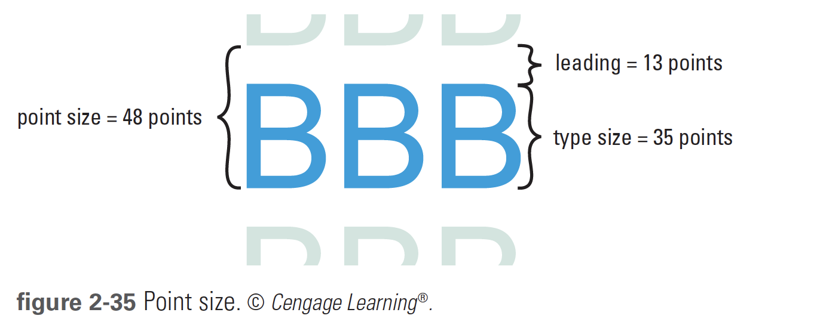

**Because type can be rendered at so many different point sizes, it is also useful to use relative units of measurement to measure type.** Relative units help us discuss the sizes of letterforms in relation to one another within a specific typeface at a specific point size. For instance, the exact height and width of a capital letter A and a lowercase letter a vary depending upon their point size, but the relationship between the two characters remains the same whether they are printed at 48 points or at 72 points and so on. That is, if a is ⅔ the height of A at one point size, it will also be ⅔ its height at any other point size, as shown by Figure 2-36.

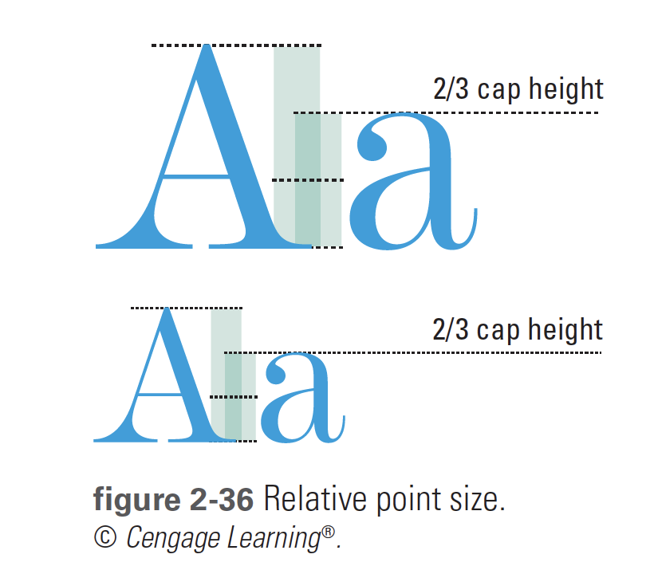

**The relative units we use to compare type dimensions within a point size are called ems (em squares) and ens (en squares), shown in Figure 2-37.** An em (or em square) is a relative unit of measurement used for making comparisons between sizes of characters and spaces within a typeface of a particular point size. An em is always a square unit equal in height and in width to the point size of a given typeface. Usually, an em square is about the same as the advance width of the capital letter M. An en is always half the width of the em square and is usually about the same as the advance width of a lowercase n. So, for example, the em square of a 12-point typeface would be 12 points wide and 12 points tall. The en square of the same typeface would be 6 points wide, but would still be 12 points tall.

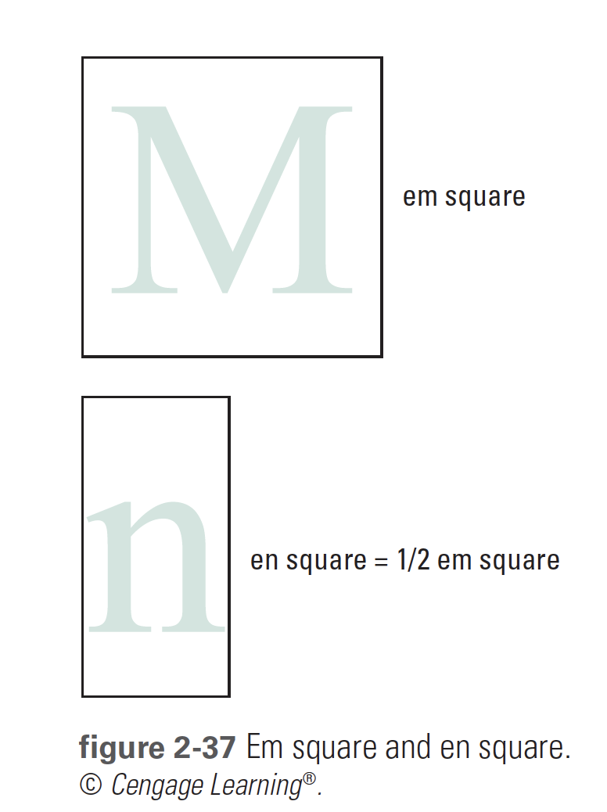

\*\*Once the em and en of a typeface have been established, the widths of characters, indentations, and spaces

## Chapter Summary

The straight and curved strokes of characters can be physically rendered and combined in a wide variety of ways to suggest a full range of meanings and associations, independent of the type’s content. The physical attributes of these strokes create a sense of identity within a typeface, making the characters seem to “go together.” These attributes are defined by the strokes, junctions, and counterforms. Terminals and serifs, contrast between thick and thin strokes, angle of stress, x-height ratio, and set width help define sameness in typefaces. The variations among these shapes are measured using a special typographic scale made up of units called picas and points. Also, relative units based on the em square are used for measuring type within a point size of a given typeface, so that size relationships can be extrapolated from one point size to another.
Learning to recognize and compare the intricacies and nuances of letterforms is an important step in learning how to effectively identify, select, and use type. This knowledge is also essential for any designer who plans to create a new typeface. Studying typographic terminology related to type anatomy and structure not only increases awareness of these subtle physical differences, but also facilitates effective communication about type and supports informed design decision-making.
